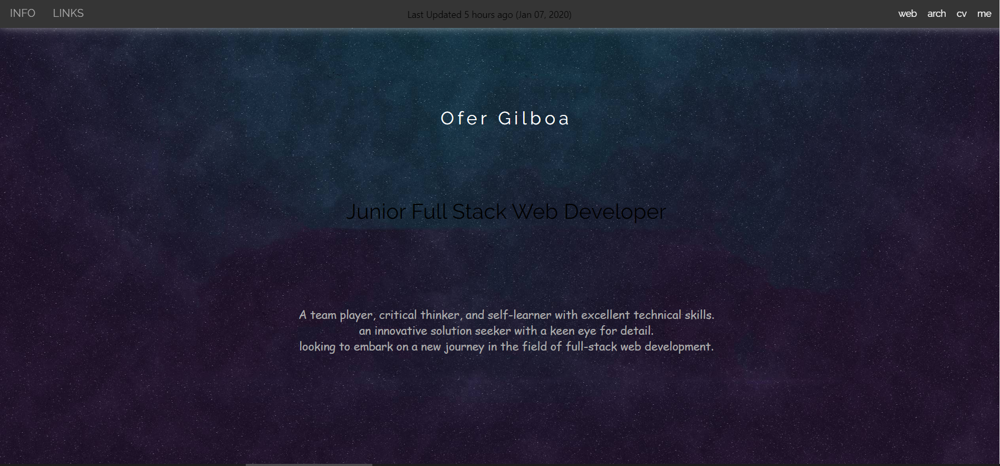
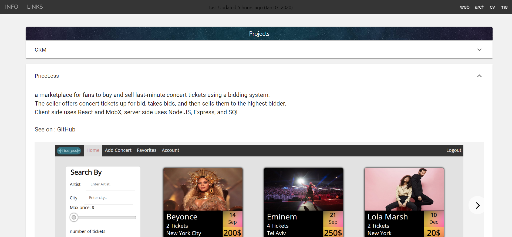
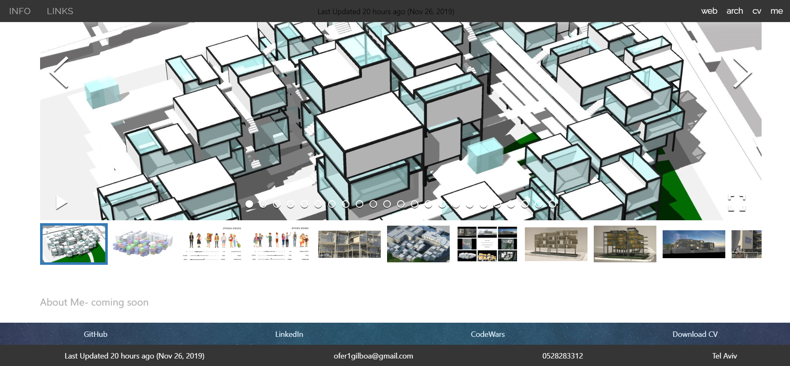
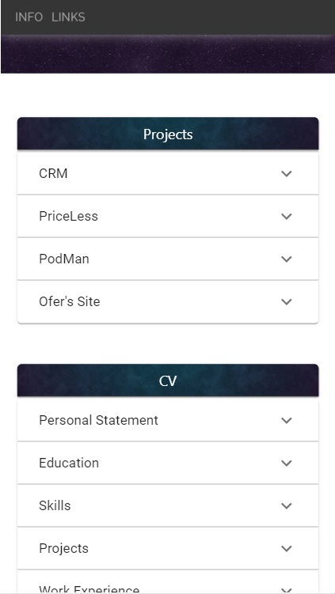
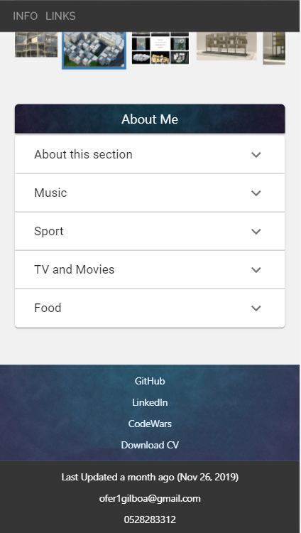

## Ofer Gilboa- My web page 
 
#### A web page for showcasing :
- chosen apps
- architecture stuff  
- my CV
- about me

constantly being updated 

#### web
 
header
 
 

 
body
 
 

 
footer
 
 

 

#### mobile
 
header
 
 

 
body
 
 

 
footer
 
 

 

### Built With:
- React

#### check it out for yourself 
 https://ofers-site.herokuapp.com/

#### to do:
- create server and DB
- save content in DB and synchronize with Heroku
- add "about me": songs audio/ video recordings
- add map with pins of current and former addresses
